# Q-Learned Delta-Theta Matrix Integration

A high-performance algorithmic trading harness that dynamically resizes multi-leg options structures to maximize theta decay while penalizing capital inefficiency. Built as a mixed Rust/Python system using PyO3 for zero-copy interop.

## Architecture

```mermaid
flowchart TB
    subgraph data ["🔌 Market Data Feeds"]
        direction LR
        tradier["TradierFeed<br/><i>Options chains, quotes, history</i>"]
        alpaca["AlpacaFeed<br/><i>Bars, snapshots, WebSocket</i>"]
    end

    subgraph python ["🐍 Python Layer"]
        direction TB

        subgraph training ["Training Pipeline"]
            env["<b>env.py</b><br/>DeltaThetaEnv · Gymnasium<br/><i>20-dim obs / 2D continuous action</i>"]
            train["<b>train.py</b><br/>SB3 SAC / PPO<br/><i>TensorBoard logging</i>"]
        end

        subgraph inference ["Live Inference"]
            live["<b>live.py</b><br/>SignalBus pub/sub<br/><i>Real-time model inference</i>"]
        end

        subgraph viz ["Visualization"]
            visualize["<b>visualize.py</b><br/>3D Plotly surfaces<br/><i>TTE × IV × Strike Width</i>"]
        end

        train -- "rollouts" --> env
        env -- "eval data" --> visualize
    end

    subgraph bridge ["⚙️ PyO3 / Maturin Bridge — Zero-Copy NumPy Arrays"]
        lib["<b>lib.rs</b><br/>PyO3 #[pymodule]<br/><i>Exposes BacktestEngine, EngineConfig,<br/>StepResult, RiskState, Greeks,<br/>PutCreditSpread, OptionLeg</i>"]
        state["<b>state.rs</b><br/>get_state_vector()<br/><i>20-dim zero-copy NumPy emission</i>"]
    end

    subgraph rust ["🦀 Rust Native Core  (nautilus-backtest)"]
        direction TB

        subgraph sim ["Order Book Simulation"]
            engine["<b>engine.rs</b> · BacktestEngine<br/><i>Nanosecond-precision ticks<br/>Episodic reset · Vol spike simulation</i>"]
            orderbook["<b>orderbook.rs</b><br/>L2 Order Book (10 levels)<br/><i>Mean-reverting random walks<br/>Multi-strike option chains</i>"]
        end

        subgraph pricing ["Options Pricing & Leg Sizing"]
            options["<b>options.rs</b><br/>Black-Scholes put pricing<br/><i>Greeks (δ, γ, θ, ν)<br/>Newton-Raphson IV solver<br/>PutCreditSpread construction</i>"]
        end

        subgraph riskmod ["Risk & Margin"]
            risk["<b>risk.rs</b> · RiskState<br/><i>Buying power tracking<br/>Margin utilization<br/>Early assignment detection<br/>Catastrophic margin calls</i>"]
        end

        engine -- "tick()" --> orderbook
        engine -- "execute_spread_trade()" --> options
        engine -- "open_position() / check_margin_call()" --> risk
        options -- "spread pricing" --> risk
        orderbook -- "IV surface & prices" --> options
    end

    %% Cross-layer data flow
    tradier -- "quotes / chains" --> live
    alpaca -- "quotes / chains" --> live
    tradier -. "historical bars" .-> env
    alpaca -. "historical bars" .-> env

    train -- "step(action)" --> env
    env -- "reset() / step()" --> lib
    live -- "step()" --> lib
    lib -- "delegates" --> engine
    lib -- "get_state_vector()" --> state
    state -- "np.ndarray (20-dim)" --> env

    engine -- "observation vec" --> state

    %% Reward flow annotation
    env -- "reward = θ − margin³·λ + PnL·0.01" --> train

    %% Styling
    classDef rustNode fill:#f5d6a8,stroke:#c97a2e,color:#333
    classDef pyNode fill:#a8d4f5,stroke:#2e7ec9,color:#333
    classDef bridgeNode fill:#d4f5a8,stroke:#5ea82e,color:#333
    classDef feedNode fill:#f5a8d4,stroke:#c92e7e,color:#333

    class engine,orderbook,options,risk rustNode
    class env,train,visualize,live pyNode
    class lib,state bridgeNode
    class tradier,alpaca feedNode
```



## Components

### Rust Core (`src/`)

| Module | Description |
|--------|-------------|
| `lib.rs` | PyO3 module entry point — exposes all types and functions to Python |
| `engine.rs` | `BacktestEngine` with nanosecond-precision order book simulation, episodic resets, and configurable tick parameters |
| `orderbook.rs` | L2 order book with 10 levels of depth, mean-reverting random walks, and multi-strike option chains |
| `options.rs` | Black-Scholes put pricing, Greeks (δ, γ, θ, ν), Newton-Raphson IV solver, put credit spread structures |
| `risk.rs` | `RiskState` tracking buying power, margin requirements, early assignment detection, and catastrophic margin calls |
| `state.rs` | Zero-copy NumPy array emission via `get_state_vector()` — 20-dimensional observation space |

### Python Layer (`python/delta_theta_matrix/`)

| Module | Description |
|--------|-------------|
| `env.py` | `DeltaThetaEnv(gymnasium.Env)` — standard Gym interface with 2D continuous action space |
| `train.py` | CLI training script — SAC/PPO via Stable Baselines3 with TensorBoard logging |
| `visualize.py` | 3D Plotly surfaces (TTE × IV × Strike Width) and reward curves |
| `live.py` | Market data feed abstraction, `SignalBus` pub/sub, real-time inference loop |
| `feeds/` | Concrete feed implementations: `TradierFeed`, `AlpacaFeed` |

## Quick Start

### Prerequisites

- Rust toolchain (1.70+)
- Python 3.13+
- [uv](https://docs.astral.sh/uv/) (recommended) or pip (fallback)

### Build

```bash
# Create a virtual environment and install dependencies
uv venv
uv pip install -e ".[dev]"

# Build and install the Rust extension
uv run maturin develop --release
```

> **Note:** If you don't have `uv`, you can fall back to pip:
> ```bash
> python -m venv .venv && source .venv/bin/activate
> pip install -e ".[dev]"
> maturin develop --release
> ```

### Train

```bash
# Train with SAC (default) for 100k timesteps
python -m delta_theta_matrix.train train --algo sac --timesteps 100000

# Train with PPO
python -m delta_theta_matrix.train train --algo ppo --timesteps 500000 --learning-rate 3e-4

# Full options
python -m delta_theta_matrix.train train \
    --algo sac \
    --timesteps 200000 \
    --learning-rate 3e-4 \
    --batch-size 256 \
    --gamma 0.99 \
    --penalty-scale 10.0 \
    --output-dir output \
    --seed 42
```

### Evaluate

```bash
# Run evaluation episodes
python -m delta_theta_matrix.train evaluate output/sac_*/final_model \
    --algo sac \
    --n-episodes 50 \
    --output output/eval_data.json
```

### Visualize

```bash
# Generate 3D surface and reward plots
python -m delta_theta_matrix.visualize --data output/eval_data.json --output output/plots/
```

### Live Inference

```python
from delta_theta_matrix.live import run_live, WebSocketFeed, SignalBus

feed = WebSocketFeed(url="wss://your-data-provider.com/market")
bus = SignalBus()
bus.register_callback(lambda signal: print(signal.to_json()))

run_live(
    model_path="output/sac_model/final_model",
    feed=feed,
    symbols=["MU", "AMD"],
    signal_bus=bus,
)
```

## Live Data Feeds

The project ships with two production-ready market data feed integrations that
implement the [`MarketDataFeed`](python/delta_theta_matrix/live.py:133) ABC and can be
plugged directly into [`run_live()`](python/delta_theta_matrix/live.py:250).

### TradierFeed

```python
from delta_theta_matrix.feeds import TradierFeed

# Reads TRADIER_API_KEY and TRADIER_SANDBOX env vars by default
feed = TradierFeed()
feed.connect()
feed.subscribe(["MU", "AMD"])

# Options chain with Greeks & IV
chain = feed.get_options_chain("MU", "2026-03-20")

# Real-time / delayed quotes
quotes = feed.get_quotes(["MU", "AMD"])

# Historical daily bars
history = feed.get_history("MU", interval="daily", start="2026-01-01", end="2026-02-01")

feed.disconnect()
```

| Env Variable | Description | Default |
|---|---|---|
| `TRADIER_API_KEY` | Tradier API bearer token | *(required)* |
| `TRADIER_SANDBOX` | `"true"` for sandbox, `"false"` for production | `"true"` |

### AlpacaFeed

```python
from delta_theta_matrix.feeds import AlpacaFeed

# Reads ALPACA_API_KEY, ALPACA_SECRET_KEY, ALPACA_PAPER env vars
feed = AlpacaFeed()
feed.connect()
feed.subscribe(["MU", "AMD"])

# Options chain snapshots
chain = feed.get_options_chain("MU", expiration_gte="2026-03-01")

# Latest stock quotes
quotes = feed.get_quotes(["MU", "AMD"])

# Historical bars
bars = feed.get_history("MU", timeframe="1Day", start="2026-01-01", end="2026-02-01")

feed.disconnect()
```

| Env Variable | Description | Default |
|---|---|---|
| `ALPACA_API_KEY` | Alpaca API key ID | *(required)* |
| `ALPACA_SECRET_KEY` | Alpaca secret key | *(required)* |
| `ALPACA_PAPER` | `"true"` for paper trading, `"false"` for live | `"true"` |

### Using feeds with `run_live()`

Both feeds are drop-in replacements for the default `WebSocketFeed`:

```python
from delta_theta_matrix.live import run_live, SignalBus
from delta_theta_matrix.feeds import TradierFeed

feed = TradierFeed()
bus = SignalBus()
bus.register_callback(lambda signal: print(signal.to_json()))

run_live(
    model_path="output/sac_model/final_model",
    feed=feed,
    symbols=["MU", "AMD"],
    signal_bus=bus,
)
```

## Observation Space (20-dimensional)

| Index | Feature | Description |
|-------|---------|-------------|
| 0 | Underlying price | Normalized by /100 |
| 1 | ATM bid-ask spread | Spread at the money |
| 2–6 | OTM put deltas | Delta at 5 strike levels |
| 7–11 | IV surface | Implied vol at 5 strikes |
| 12 | Time-to-expiry | In years |
| 13 | Current IV | Overall implied volatility |
| 14 | Margin utilization | Ratio of margin used to buying power |
| 15 | Theta exposure | Net theta across positions |
| 16 | Buying power | Normalized to initial |
| 17 | Episode progress | Step / max_steps |
| 18 | Position count | Number of open spreads |
| 19 | Episode P&L | Normalized by /1000 |

## Action Space

| Dimension | Range | Maps To |
|-----------|-------|---------|
| strike_width | [-1, 1] | $2.50 – $15.00 spread width |
| delta_position | [-1, 1] | -0.50 – -0.05 short put delta |

## Reward Function

```
reward = θ_captured − (margin_utilization³) × penalty_scale + P&L × 0.01
```

- **Theta captured**: Absolute net theta exposure across positions
- **Margin penalty**: Cubic penalty on margin utilization discourages over-leveraging
- **P&L component**: Small weight on realized P&L for directional signal
- **Margin call**: −100 terminal penalty
- **Expiration**: +10% of episode P&L bonus

## Configuration

`EngineConfig` parameters:

| Parameter | Default | Description |
|-----------|---------|-------------|
| `tickers` | `["MU", "AMD"]` | Underlying symbols |
| `initial_prices` | `[85.0, 120.0]` | Starting prices |
| `initial_buying_power` | `100,000` | Starting capital |
| `risk_free_rate` | `0.05` | Annual risk-free rate |
| `initial_tte` | `0.0833` | ~30 days to expiry |
| `max_episode_steps` | `1000` | Steps before truncation |
| `base_iv` | `0.30` | Base implied volatility |
| `vol_spike_prob` | `0.02` | Probability of IV spike per tick |
| `vol_spike_magnitude` | `1.5` | IV spike multiplier |

## Development

```bash
# Run Rust tests
cargo test

# Build in debug mode
uv run maturin develop

# Build optimized release
uv run maturin develop --release

# Monitor training with TensorBoard
uv run tensorboard --logdir output/*/tensorboard
```

## License

MIT
